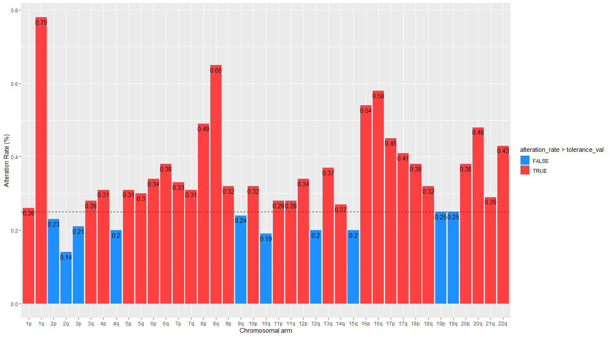
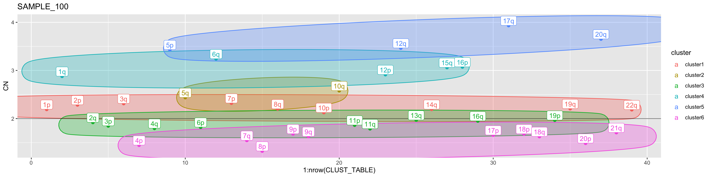

```{r style, eval=TRUE, echo = FALSE, results = 'asis'}
BiocStyle::latex()
```

# Overview

The R package BoBafit is composed of four functions which allow the refit and the recalibration of copy number profile of tumor sample. In particular, the package was built to check, and possibly correct, the diploid regions. The wrong diploid region is a phenomenon that very often affects the profiles of samples with a very complex karyotype.

The principal and refitting function was named `DRrefit`, which - throughout a chromosome clustering method and a list of unaltered chromosomes (chromosome list) - recalibrates the copy number values. BoBafit also contains three secondary functions: `ComputeNormalChromosome`, which generates the chromosome list; `PlotChrCluster`, where is possible to visualize the cluster; and `Popeye`, which affixes its chromosomal arm to each segment (see in "Data Preparation" vignette).

# Data

The package checks the diploid region assessment working on pre-estimated segment information, as the copy number and their position. We included a data set `TCGA_BRCA_CN_segments` where are showed all the information necessary. The data correspond to segments about 100 breast tumors samples obtained by the project TCGA-BRCA [@Tomczak2015]. In the "Data Preparation" vingnette is shown how we download and prepare the dataset for the following analysis.

```{r load data, echo=FALSE, message=FALSE, paged.print=FALSE, results='asis'}
library(BOBaFIT)
data("TCGA_BRCA_CN_segments.RData")
#it is very important to have the same colomn names
knitr::kable(head(TCGA_BRCA_CN_segments))
```

# BOBaFIT Workflow

Once the dataset has been prepared, the next step is to generate the chromosome list. The chromosome list is a vector containing all chromosomal arm which are the least affected by SCNAs in the tumor analyzed. Together with the clustering, the chromosome list is one the operating principles to rewrite the diploid region. The list can be manually created or by using the function `ComputeNormalChromosome`*.* We suggest these two sequential steps to allow the right refit and recalibration of sample's diploid region:

1.  `ComputeNormalChromosome()`

2.  `DRrefit()`

Here we performed this analysis workflow on the dataset `TCGA_BRCA_CN_segments` described above.

## ComputeNormalChromosome

The chromosome list is a vector specific for each tumor (type and subtype) . The chromosome arms included in this list must be selected based on how many CNA events they are subject to and how many times their CN falls into a "diploid range". According to this principle, *ComputeNormalChromosome* write the chromosome list. The function allows to set the chromosomal alteration rate (`tolerance_val`), which corresponds to a minimum percentage of alterations that one wants to tolerate per arm.

With a little dataframe (less than 200 samples), we suggest an alteration rate of 5% (0.5) ; on the contrary, With a big dataframe (about 1000 samples), we suggest as maximum rate 20-25% (0.20-0.25) . The function input is a sample cohort with their segments.

Here we performed the function in the data set `TCGA_BRCA_CN_segments`, using an alteration rate of 25%.

```{r computeNormalChromosome, fig.show='hide', include=FALSE, results='hide'}
chr_list <- computeNormalChromosomes(segments = TCGA_BRCA_CN_segments, tolerance_val = 0.25)
```

```{r chr_list, results='asis'}
chr_list
```

Storing the result in the variable `chr_list`, it will be a vector containing the chromosomal arms which present an alteration rate under the indicated `tolerance_val` value.

The function also plots in the Viewer a histogram where is possible observe the chromosomal alteration rate of each chromosomal arms and which one have been selected in the chromosome list (blue bars). The tolerance value has been set at 0.25 (dotted line).



## DRrefit

To create a tumor-specific method that refit and recalibrate the tumor copy number profile, we developed the function `DRrefit`. It uses as input the sample's segments - **cohort** or **single sample**-, and the chromosome list.

As said before, `DRrefit` estimates the right diploid region using two operating principle: a clustering function `NbClust` [@charrad2014], which allow to estimete the best number of cluster in the sample, and the chromosome list. The clustering method can be sets with the argument `clust_method`. The options are: "ward.D", "ward.D2", "single", "complete", "average", "mcquitty", "median", "centroid" and "kmeans".

In this example, the `TCGA_BRCA_CN_segments`data table and the `chr_list` previously generated are used. The default value of `maxCN` (6) and `clust_method` (ward.d2) are used.

```{r DRrefit, message=FALSE}
results <- DRrefit (segments_chort = TCGA_BRCA_CN_segments, chrlist = chr_list)

```

### The Dataframes

-   The data frame `segments corrected` reports the CN corrected of the segments by the correction factor (CR) - value estimated for each sample by the function to correct the diploid region-

```{r Call segments DRrefit 1}
knitr::kable(head(results$segments_corrected))
```

It is similar to the input one and report the new CN value of each segment calculated by DRrefit (`CN_corrected`).

-   The data frame `report` contains all the information about the clustering as the outcome,the number of clusters found in that sample, the chromosome list and the CR used for the adjustment of the diploid region. Sample are also divided in three classes, based on their CR: No changes (CR\<0.1); Recalibrated (0.1\<CR\<0.5); Refitted (CR \>0.5). The class label is also reported in the data frame `report`.

```{r Call report DRrefit 2, echo=FALSE}
 knitr::kable(head(results$report))

```

When the column `clustering` reports FAIL, it indicates that , NbClust fails the chromosome clustering in that sample. In this case, the sample will not present clusters, so the input chromosome list will be kept as reference . When the column `clustering` reports SUCCED, NbClust succeeds and and the new chromosome list is chosen. The chromosome list used for each sample are all reported in the column `ref_clust_chr`.

## DRrefit_plot

Thanks to the function `DRrefit_plot` is possible appreciate the CN profile before and after the correction made by`DRrefit`. It makes a plot for each sample with the old and new segments positions. The x-axes represent the chromosomes with their genomic position, and the y-axes the copy number value. Above the plot are reported the sample name, the CR and the chromosomal arm used as reference to estimate the new diploid region.

```{r DRrefit_plot, eval=FALSE}
segments_corrected <- results$segments_corrected
report <- results$report
# the plot is diplayed on the R viewer
DRrefit_plot(segments_refitted = segments_corrected,
             DRrefit_report = report, 
             plot_viewer = TRUE, 
             plot_save = FALSE )

# the plots are saved in a specific path according to the chosen format
DRrefit_plot(segments_refitted = segments_corrected,
             DRrefit_report = report, 
             plot_save = TRUE, plot_format = "pdf", plot_path = "/my_path" )
```

Based on the CR value two plots can be displayed:

-   CR ≤ 0.1: the new segment and the old segments are orange and red colored, respectively;

{style="style" width="32in"}

-   CR \> 0.1: the new segment and the old segments are green and red colored, respectively;

{width="100%"}

# PlotChrCluster

Another accessory function is `PlotChrCluster`. It can be used to visualize the chromosomal cluster in a single sample or in a sample cohort. The input data is always a .tsv file, as the data frame `TCGA_BRCA_CN_segments`. The option of `clust_method` argument are the same of `DRrefit`("ward.D", "ward.D2", "single", "complete", "average", "mcquitty", "median", "centroid" and "kmeans").

```{r PlotChrCluster, message=FALSE, warning=FALSE}
Cluster <- PlotChrCluster(segs = TCGA_BRCA_CN_segments,
                       clust_method = "ward.D2",
                       plot_output= FALSE)
```

We suggest to store the output on a variable (in this example we use `Cluster`) to view and possibly save the data frame generated. The `PlotCuster` will automatically save the plot in the folder indicated by the variable `path` of the argument `plot_path`.

In the `PlotChrCluster` plot, the chromosomal arms are labeled and colored according to the cluster they belong to. The y-axis reports the arm CN.

{style="text-align: center;" width="100%"}

### The Dataframes

The output `report` is a data frame which reports for each sample the clustering outcome (fail or succeeded) and the number of clusters for each sample analyzed.

```{r Call report PlotChrCluster 3, echo=FALSE}
knitr::kable(head(Cluster$report))

```

The second output that will be stored in the Cluster variable is a list of data frames, one for each sample analyzed, where are reported the information about the plot.

```{r  Call sample table 2,echo=FALSE, message=FALSE, paged.print=FALSE, results='asis'}
knitr::kable(head(Cluster$plot_tables$SAMPLE_1))
```

# Session info {.unnumbered}

```{r sessionInfo, echo=TRUE, print=TRUE, results='hold', collapse=TRUE, }
sessionInfo()
```

# Reference {.unnumbered}
