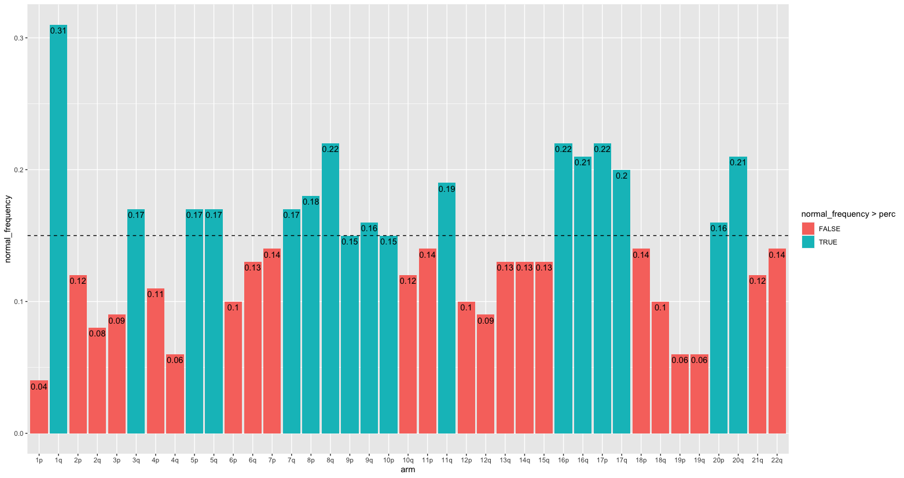
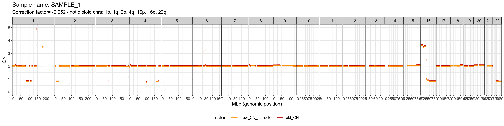
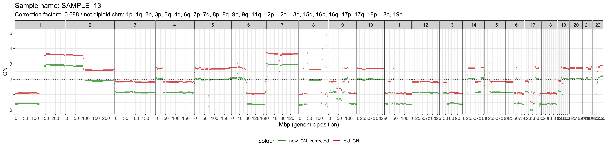

```{r style, eval=TRUE, echo = FALSE, results = 'asis'}
BiocStyle::latex()
```
# Overview

The R package BoBafit is composed of three functions which allow the refit and the recalibration of copy number profile of tumor sample. The principal and refitting function was named `DRrefit`, which - throughout a chromosome clustering method and a list of unaltered chromosomes (chromosome list) - recalibrates the copy number values. BoBafit also contains two secondary functions, the `ComputeNormalChromosome`, which generates the chromosome list, and the `PlotCluster`.

# Data

The package checks the diploid region assessment working on pre-estimated segment information, as the copy number and their position. We included a data set `segments` where are showed all the information necessary. The data correspond to segments about 100 breast tumors samples obtained by the project TCGA-BRCA [@Tomczak2015].

```{r echo=FALSE, message=FALSE, paged.print=FALSE, results='asis'}
library(BOBaFIT)
data("segments")
knitr::kable(head(segments))
```

# BOBaFIT workflow

To start the analysis of the diploid region made by BOBaFIT, .tsv files , containing the sample copy number profile, and the chromosome list are needed as inputs. The chromosome list is the list of chromosomes which are the least affected by SCNAs in the tumor and can be manually created or by using the function `ComputeNormalChromosome`*.* We suggest these two sequential steps to allow the right refit and recalibration of sample's diploid region:

1.  `ComputeNormalChromosome()`

2.  `DRrefit()`

Here we performed this analysis workflow on the dataset `segments` described above.

## ComputeNormalChromosome

The chromosome list is a vector that contains the chromosomal arms considered "normal" in the cohort of samples tested. Chromosomes included in the list should be selected when their CN values are subject to minimal fluctuation and tend to remain within the diploid range in the analyzed tumor. *ComputeNormalChromosome* allows to set the chromosomal alteration rate (`perc`). For a more stringent analysis, we suggest an alteration rate of 5% (0.5) ; on the contrary, for a more permissive analysis, we suggest as maximum rate 20-25% (0.20-0.25) . The function input is a sample cohort with their segments.

Here we performed the function in the data set `segments`, using an alteration rate of 15%.

```{r computeNormalChromosome, echo=TRUE, results='hide', fig.show='hide'}
library(BOBaFIT)
chr_list <- computeNormalChromosomes(segments = segments, perc = 0.15)
```

```{r results='asis'}
chr_list
```

Storing the result in the variable `chr_list`, it will be a vector containing the chromosomal arms which present an alteration rate under the indicated `perc` value.

### Figure

Following, the function shows in the Viewer a plot where is possible observe the chromosomal alteration rate of each chromosomal arms and which one have been selected in the chromosome list (Blue bars).

{width="100%"}

## DRrefit

To create a tumor-specific method that refit and recalibrate the tumor copy number profile, we developed the function `DRrefit`. It uses as input the sample's segments (.tsv) - cohort or single sample-, and the chromosome list. More in details, this function to estimate the right diploid region uses the clustering function `NbClust` [@charrad2014] and the method of clustering can be sets by the user with the argument `clust_method`. The option of this argument are: "ward.D", "ward.D2", "single", "complete", "average", "mcquitty", "median", "centroid" and "kmeans".

In this example, the `segment` data table and the `chr_list` previously generated are used. The default value of `maxCN` (6) and `clust_method` (ward.d2) are used.

```{r DRrefit, eval=FALSE}

library(BOBaFIT)

Results <- DRrefit (segments_chort = segments, 
        chrlist = chr_list, 
        plot_output = TRUE, 
        plot_path = path)

```

Setting the argument `plot_output` TRUE, the function will automatically save the plot in the folder indicated by the variable `path`. Therefore, the `plot_path` argument must be given. Instead the `plot_output` is set as FALSE, the `plot_path` can not be indicated. We suggest to store the output of `DRrefit` in a variable (in this example we use `Results`) to view and possibly save the two data frames generated. The plot and the data frames are explained in the next sections.

### Tables

The two output data framesare :

-   The data frame `segments corrected`, containing the segment CN adjusted by the correction factor (CR) - value estimated by the function to correct the diploid region- of all samples analyzed.

```{r call table DRrefit, eval=FALSE}
Results$segments_corrected
```

```{r Table DRefit, echo=FALSE, message=FALSE, paged.print=FALSE, results='asis'}
    library(BOBaFIT)
    data("segment_corrected")
    knitr::kable(head(segment_corrected))
```

It is similar to the input one and report the new CN value of each segment calculated by DRrefit (`CN_corrected`).

-   The data frame `report`, which contains all the information about the clustering as the outcome,the number of clusters found in that sample, the chromosome list and the CR used for the adjstment of the diploid region.

```{r Call report DRrefit, eval=FALSE}
Results$report
```

```{r Report DRrefit, echo=FALSE, message=FALSE, paged.print=FALSE, results='asis'}
    library(BOBaFIT)
    data("report")
    knitr::kable(head(report))
```

When the column `clustering` reports FAIL, it indicates that , NbClust fails the chromosome clustering in that sample. In this case, the sample will not present clusters, so the input chromosome list will be kept as reference . When the column `clustering` reports SUCCED, NbClust succeeds and and the new chromosome list is chosen. The chromosome list used for each sample are all reported in the column `ref_clust_chr`.

### Figure

Another output of DRrefit is a plot for each sample with the old and new segments positions, where we can appreciate the new copy number profile. The x-axes represent the chromosomes with their genomic position, and the y-axes the copy number value. The dashed line shows the diploid region. Above the plot are reported the sample name, the CR and the chromosomal arm excluded by the new chromosome list.

Based on the CR value two plots can be displayed:

-   CR ≤ 0.1: the new segment and the old segments are orange and red colored, respectively;

{width="100%"}

-   CR \> 0.1: the new segment and the old segments are green and red colored, respectively;

{width="100%"}

# PlotCluster

The accessory function is `PlotCluster`. It can be used to visualize the chromosomal cluster in a single sample. It can cluster either a sample cohort or a single sample and the input data is always a .tsv file as the data frame `segments`. The option of `clust_method` argument are the same of `DRrefit`("ward.D", "ward.D2", "single", "complete", "average", "mcquitty", "median", "centroid" and "kmeans").

```{r eval=FALSE}
library(BOBaFIT)
Cluster <- PlotCluster(segs = segments,
                       clust_method = "ward.D2", 
                       plot_path = path)

```

We suggest to store the output on a variable (in this example we use `Cluster`) to view and possibly save the data frame generated. The `PlotCuster` will automatically save the plot in the folder indicated by the variable `path` of the argument `plot_path`. All the outputs are explained and shown in the next section.

### Figure

In the `PlotCluster` plot, the chromosomal arms are labeled and colored according to the cluster they belong to. The y-axis reports the arm CN.

{style="text-align: center;" width="100%"}

### Tables

The output `report` is a data frame which reports for each sample the clustering outcome (fail or succeeded) and the number of clusters for each sample analyzed.

```{r eval=FALSE}
Cluster$report
```

```{r echo=FALSE, message=FALSE, paged.print=FALSE, results='asis'}
 library(BOBaFIT)
    data("plot_clust_rep")
    knitr::kable(head(plot_clust_rep))
```

The second output that will be stored in the Cluster variable is a list of dataframes, one for each sample analyzed, where are reported the information about the plot.

```{r eval=FALSE}
Cluster$plot_tables$SAMPLE_1
```

```{r echo=FALSE, message=FALSE, paged.print=FALSE, results='asis'}
 library(BOBaFIT)
    data("plot_clust_rep2")
    knitr::kable(head(plot_clust_rep2))
```

# Session info {.unnumbered}

```{r sessionInfo, results='asis', print=TRUE, eval=TRUE}
sessionInfo()
```

# Reference {.unnumbered}
