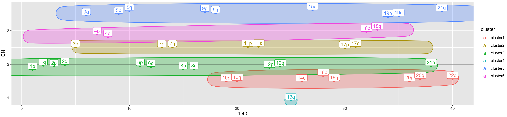

<script type="text/javascript">
document.addEventListener("DOMContentLoaded", function() {
  document.querySelector("h1").className = "title";
});
</script>
<script type="text/javascript">
document.addEventListener("DOMContentLoaded", function() {
  var links = document.links;  
  for (var i = 0, linksLength = links.length; i < linksLength; i++)
    if (links[i].hostname != window.location.hostname)
      links[i].target = '_blank';
});
</script>

The R package BoBafit is composed of three functions which allow the refit and the recalibration of copy number profile of tumor sample. The principal and refitting function was named `DRrefit`, which - throughout a chromosome clustering method and a list of unaltered chromosomes (chromosome list) - recalibrates the copy number values. BoBafit also contains two secondary functions, the `ComputeNormalChromosome`, which generates the chromosome list, and the `PlotCluster`.

# Data

The package checks the diploid region assessment, after they have been estimated by the main analysis algorithm, as Rawcopy and ASCAT (Mayrhofer et al., 2016b; P. Van Loo et al., 2010), working on pre-estimated segment information, as the copy number and their position. We included a data set where are showed all the information necessary. The data correspond to segments about 100 breast tumors samples obtained by the project TCGA-BRCA [@Tomczak2015].


| chr|    start|      end|arm |        CN|ID       |    width|
|---:|--------:|--------:|:---|---------:|:--------|--------:|
|   1|    62920| 15823420|1p  | 2.0676615|SAMPLE_1 | 15760501|
|   1| 15827002| 15827430|1p  | 0.1767767|SAMPLE_1 |      429|
|   1| 15827706| 16542868|1p  | 2.0567460|SAMPLE_1 |   715163|
|   1| 16544783| 16617312|1p  | 0.6907243|SAMPLE_1 |    72530|
|   1| 16617327| 16864367|1p  | 1.5530356|SAMPLE_1 |   247041|
|   1| 16868660| 16898730|1p  | 0.5849412|SAMPLE_1 |    30071|

# BOBaFIT workflow

# DRrefit

To create a tumor-specific method that checks and adjusts the tumor copy number profile, we developed the function `DRrefit`. It uses the sample's segments obtained from the preceding genomic analysis. The segments data can be produced either by NGS and array analysis. The input data frame must contain five information: the sample ID, the chromosome arm to which the segments belong, the start and end and the CN value.

`DRrefit` can refit and recalibrate either a sample cohort or a single sample. The second input of DRrefit is the `chromosome list`, which contains the chromosomes that are minimally affected by SCNAs. This list can be defined by the user, either according to the knowledges of the tumor or by using analysis tools, which measures the densities of copy number changes within chromosomes (IGV). To simply this step, BoBafit package includes a function designed for the computing of the "normal" chromosome list, named `ComputeNormalChromosome`.


```r
library(BOBaFIT)

chr_list <- c("10q","11p","18p","18q","19p","19q","1p","4q","6p","6q","7p")

Results <- DRrefit (segments_chort = segments, 
        chrlist = chr_list, 
        plot_output = TRUE, 
        plot_path = path)
```

## Tables

1.  The data frame containing the segments of all samples. It reports arm, chromosome, start and end, sample ID, old CN and corrected CN.

    
    ```r
    Results$segments_corrected
    ```

    
    | chr|    start|      end|arm |        CN|ID       |    width| CN_corrected|
    |---:|--------:|--------:|:---|---------:|:--------|--------:|------------:|
    |   1|    62920| 15823420|1p  | 2.0676615|SAMPLE_1 | 15760500|    2.0155736|
    |   1| 15827002| 15827430|1p  | 0.1767767|SAMPLE_1 |      428|    0.1246888|
    |   1| 15827706| 16542868|1p  | 2.0567460|SAMPLE_1 |   715162|    2.0046581|
    |   1| 16544783| 16617312|1p  | 0.6907243|SAMPLE_1 |    72529|    0.6386364|
    |   1| 16617327| 16864367|1p  | 1.5530356|SAMPLE_1 |   247040|    1.5009477|
    |   1| 16868660| 16898730|1p  | 0.5849412|SAMPLE_1 |    30070|    0.5328534|

2.  The clustering report, a data frame which reports per sample

    
    ```r
    Results$report
    ```

    
    |sample   |clustering |ref_clust_chr                                                                                                                                    | num_clust| correction_factor|
    |:--------|:----------|:------------------------------------------------------------------------------------------------------------------------------------------------|---------:|-----------------:|
    |SAMPLE_1 |SUCCEDED   |10p, 10q, 11p, 11q, 12p, 12q, 13q, 14q, 15q, 17p, 17q, 18p, 18q, 19p, 19q, 20p, 20q, 21q, 2q, 3p, 3q, 4p, 5p, 5q, 6p, 6q, 7p, 7q, 8p, 8q, 9p, 9q |         5|        -0.0520879|
    |SAMPLE_2 |SUCCEDED   |10p, 11p, 11q, 12q, 13q, 14q, 15q, 16p, 17q, 18p, 18q, 1q, 20q, 21q, 3p, 5q, 6p, 6q, 8q                                                          |         5|        -0.0490066|
    |SAMPLE_3 |SUCCEDED   |12q, 15q, 16p, 16q, 17p, 17q, 18p, 18q, 19p, 19q, 1p, 1q, 20q, 22q, 2p, 2q, 3p, 3q, 6p, 6q, 7p, 7q, 9q                                           |         3|        -0.4587184|
    |SAMPLE_4 |SUCCEDED   |10p, 10q, 11p, 11q, 12p, 12q, 13q, 14q, 15q, 16q, 17q, 18p, 18q, 1q, 20p, 20q, 21q, 2p, 2q, 3p, 3q, 4p, 4q, 5p, 5q, 6p, 6q, 7p, 7q, 8p, 8q       |         3|        -0.0196744|
    |SAMPLE_5 |SUCCEDED   |10q, 11p, 11q, 12q, 13q, 14q, 18p, 18q, 1q, 21q, 2p, 2q, 3p, 3q, 4p, 4q, 5p, 5q, 6p, 6q, 7p, 7q, 8q, 9p                                          |         2|        -0.0206308|
    |SAMPLE_6 |SUCCEDED   |11q, 12q, 16q, 17p, 17q, 18p, 18q, 1p, 1q, 21q, 3q, 5p, 5q, 6p, 6q, 7p                                                                           |         6|        -0.0455488|

## Figure

Based on the correction factor (CR) value, two plots can be displayed:

-   CR ≤ 0.1: the new segment and the old segments are orange and red colored, respectively;

-   CR \> 0.1: the new segment and the old segments are green and red colored, respectively;

    {width="767"}

    

## 

# ComputeNormalChromosome

*ComputeNormalChromosome* is a secondary function of the package ***BoBafit*** and it can be used to estimate the chromosome list. The chromosome list is a vector that contains the arm considered "normal" in the cohort of samples tested. Chromosomes included in the list should be selected when their CN values are subject to minimal fluctuation and tend to remain within the diploid range. For that reason, they can be considered the reference for the diploid region estimation. Using *ComputeNormalChromosome*, the chromosomes list and the following adjustment of the diploid region are made *ad hoc* for the tumor to be analyzed. In addition, *ComputeNormalChromosome* allows to set the chromosomal alteration rate. For a more stringent analysis, the chromosomes that are altered in 5% of cases can be selected; on the contrary, for a more permissive analysis, the chromosomes with an alteration rate of 20-25% can be selected.

The function input is a sample cohort with their segments. The table has to report the sample ID, the chromosome arm to which the segments belong, the start and end and the copy number value.


```r
library(BOBaFIT)

chr_list <- computeNormalChromosomes(segments = segments)
path <- "."
DRrefit (segments_chort = segments, 
        chrlist = chr_list, 
        plot_output = TRUE, 
        plot_path = path)
```

# PlotCluster

The second accessory function is *PlotCluster*. It can be used to visualize the chromosomal cluster in a single sample. The function does not modify the segments CN and was created to explore the data and appreciate the fine clustering method. It can cluster either a sample cohort or a single sample and the input data frame have to contain segments with the sample ID, the chromosome arm to which the segments belong, the start and end, and the copy number value.

## Tables

The report of clustering, a data frame which reports for each sample the clustering outcome (fail or succeeded) and the number of clusters.

## Figure

The plot of clusters for each sample, where the chromosomal arms are labelled and colored according to the cluster they belong to. The y-axis represents the CN, and it is possible to appreciate the CN values covered by that cluster with colored regions


